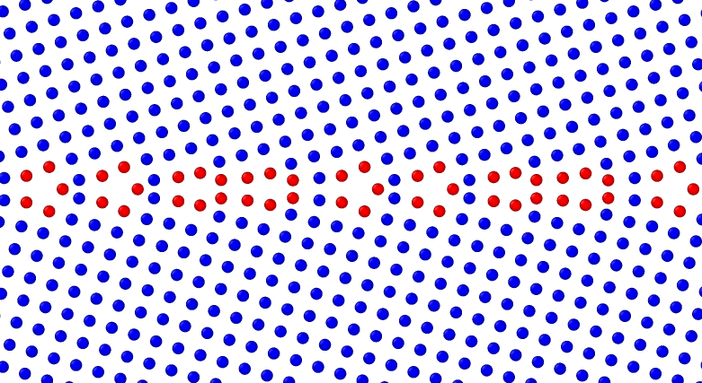

## GB Energy vs. Tilt Angle

\
Grain boundary energy of the 10 Symmetrical tilt<001> grain boundaries studied using (a) Optimised Tersoff(MOD-TF) potential and (b) Stillinger Weber potential is ploted as a function of misorientation angle $\theta$.

## Atomic Structures of GB Interface 

| Sl. No | GB Angle                              | Structure (a) SW                               | Structure (b) MOF-TF                           | Type |
|:------:|:-------------------------------------:|:----------------------------------------------:|:----------------------------------------------:|:----:|
| 1      |  $\Sigma 401	(20 1 0) [\theta= 5.73]$ |  $\gamma_{gb}=0.66$ |  $\gamma_{gb}=0.66$ |LA    |  
| 2      |  $\Sigma 37	 (6 1 0) [\theta=18.93]$ |  $\gamma_{gb}=0.86$ |  $\gamma_{gb}=0.74$ |IM    |
| 3      |  $\Sigma 13	 (5 1 0) [\theta=22.62]$ |  $\gamma_{gb}=0.88$ |  $\gamma_{gb}=0.73$ |IM    |
| 4      |  $\Sigma 5	   (3 1 0) [\theta=36.87]$ |  $\gamma_{gb}=0.67$ |  $\gamma_{gb}=0.64$ |IM    |
| 5      |  $\Sigma 5	   (2 1 0) [\theta=53.13]$ |  $\gamma_{gb}=0.68$ |  $\gamma_{gb}=0.55$ |IM    |
| 6      |  $\Sigma 53	 (9 5 0) [\theta=58.11]$ |  $\gamma_{gb}=0.78$ |  $\gamma_{gb}=0.75$ |IM    |
| 7      |  $\Sigma 17	 (5 3 0) [\theta=61.92]$ |  $\gamma_{gb}=0.77$ |  $\gamma_{gb}=0.72$ |IM    |
| 8      |  $\Sigma 13	 (3 2 0) [\theta=67.38]$ |  $\gamma_{gb}=0.76$ |  $\gamma_{gb}=0.73$ |IM    |
| 9      |  $\Sigma 85	 (7 6 0) [\theta=81.50]$ |  $\gamma_{gb}=0.56$ |  $\gamma_{gb}=0.58$ |HA    |
| 10     |  $\Sigma 181	(10 9 0) [\theta=83.97]$ |  $\gamma_{gb}=0.46$ |  $\gamma_{gb}=0.49$ |HA    |

<!-- **important observations**

* we observe the basic SU with Kite-like strucutre with 5 atom rings followed by 3 atom rings as reported in the literature.[2018 paper ml potential]
* the structural unites resembles/matches the work of misin and others
* clearly shows that the structures predicted by different interatomic potential were different
* the offset in gbe values predicted by sw potential is due to higher ecoh per atom as compred to tf potential
* comment on the singlular gb; that has 3-5; 3-4-5 atomic rings;
* all of these structures have five atom rings
* you can claculate the discance bw 5 atom rings - and normalise
* i observe 3 atom right adjacet to 5 atom rings in all the cases;
* SIGMA37 exp no 2 has two five atom rings; alignment is different;
* significant structre difference in exp 3 sig 13 22.6 deg; it has 3-6 atom ring; tf has 6 atom rig - ordered; sw has 5 atom ring;
* sigma5 perfect; 3-5; 3-4-5;
* all the structure has a basic unit of 5 atom ring -->
