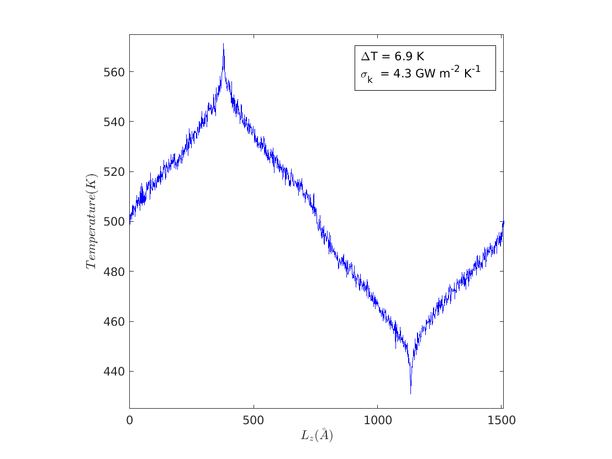
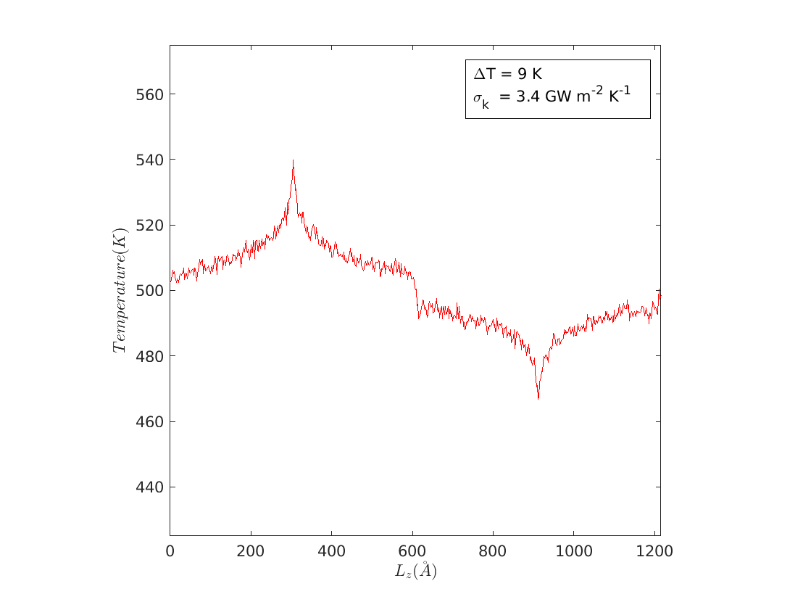
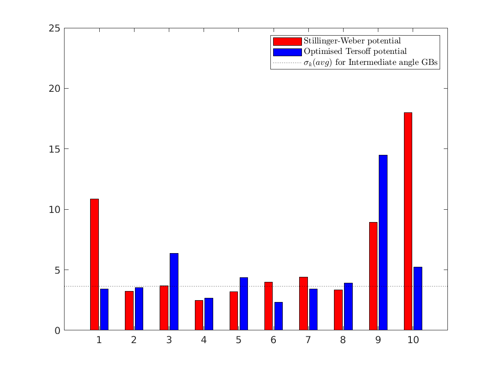

# RESULTS - II

-------------------------------------------------------------------------------------------
## Table1:Temperature Profile of Grain Boundaries

| Sl. No | GB Nomenclature                       | Temperature Profile (a) SW   | Temperature Profile (b) T                | Type |
|:------:|:-------------------------------------:|:----------------------------:|:----------------------------------------:|:----:|:----:|
| 1      |  $\Sigma 401	(20 1 0) [\theta= 5.73]$ |  |  |LA    |
| 2      |  $\Sigma 37	 (6 1 0) [\theta=18.93]$ |  |  |IM    |
| 3      |  $\Sigma 13	 (5 1 0) [\theta=22.62]$ |  |  |IM    |
| 4      |  $\Sigma 5	   (3 1 0) [\theta=36.87]$ |  |  |IM    |
| 5      |  $\Sigma 5	   (2 1 0) [\theta=53.13]$ |  |  |IM    |
| 6      |  $\Sigma 53	 (9 5 0) [\theta=58.11]$ |  |  |IM    |
| 7      |  $\Sigma 17	 (5 3 0) [\theta=61.92]$ |  |  |IM    |
| 8      |  $\Sigma 13	 (3 2 0) [\theta=67.38]$ |  |  |IM    |
| 9      |  $\Sigma 85	 (7 6 0) [\theta=81.50]$ |  |  |HA    |
| 10     |  $\Sigma 181	(10 9 0) [\theta=83.97]$ |  |  |HA  |

-------------------------------------------------------------------------------------------

## Literature Results and This work comparision -(b) TF case ONLY
\
Comparision of {GBE vs. KC} results of *this work*(circles) and the *Hickman 2020*(asterisk).

NOTE: For SW case we do have any literature results to compare and hence we compare it with TF results.

## $\Delta T$ compareision (a) SW (b) TF
\
Comparision of temperature drop observed at the GB interface for SW and TF models. The no's 1, 2, ..., 10 represents the "Sl. No" corresponding to the GBs as given in the Table1.
Y-axis is the measure of $\Delta T$ in Kelvin.

## Equation:2

$J=\sigma_k \Delta T$

## Kapitza conductance compareision (a) SW (b) TF
\
Comparision of Kapitza conductance calculated from the equation(2) at the GB interface for SW and TF models.

## Same as plot above - with horizontal bar - for visual guide - comparision;

------------------------------------------

## SW Case: GB Energy Vs. Kapitza Conductance

## TF Case: GB Energy Vs. Kapitza Conductance

